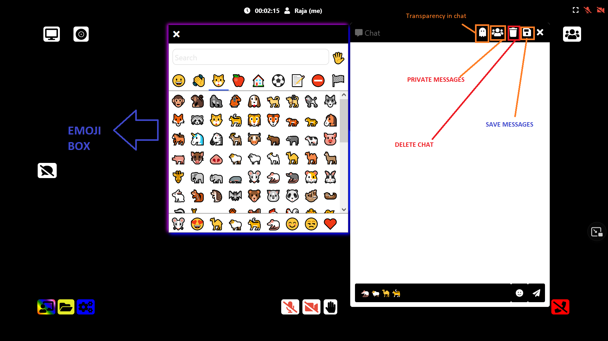

# Fluent

<br>

## Agile methodology (Timeline shown)

1. Week-1  (Sprint 1)

-- Study different video conferencing applications.

-- Worked on creating server using express and using webrtc to enable camera and mic.

-- Desingning front-end web page.

-- Implemented basic functionality.

-- Design landing page.

2. Week-2  (Sprint 2)

-- Adding screen-recording , screen-sharing and whiteboard in the app.

-- Review and fix bugs.

-- Design client page.

3. Week-3  (Sprint 3) (Special feature announced)

-- Adjusting to update chat feature announced. Added chat feature while meeting.

-- Deploy and Test.

-- Implement chat functionality

4. Week-4  (sprint 4)

-- Working on other features and preparing video for app demonstration. 

-- Create documentation and README.

-- Create demo video

<br>

## Challenges Faced
During the development process I faced the following challenges:

1. Started learning nodesjs , react , and watched many youtube videos, which helped me to reach
   basic functionality of the video call application.

2. I explored many github repositories and they were the main help during my process of building.
   Reading documentation was always not enough since I didn't have enough experience in creating softwares.

3. I learnt how to incorporate special feature functionality in the application after many trials
   error.

4. Overall the I learnt many new skills in this program, after struggling a lot since I was a complete beginner. The engage program was quite fruitful. 


## Powered by `WebRTC` using google Stun

[](https://fluent-video.herokuapp.com/)

<br>

Open the app in one of following **supported browser**

[](https://fluent-video.herokuapp.com/)

## [Hosted App](https://fluent-video.herokuapp.com/)

## [Youtube Video](https://youtu.be/fYckR9TRPAI)

<br>

[](https://fluent-video.herokuapp.com/)

## Features

- Unlimited number of conference rooms without call time limitation
- Desktop and Mobile compatible
- Optimized Room Url Sharing (share it to your participants, wait them to join)
- Video Calling
- Audio Streaming
- Screen Sharing to present documents, slides, and more...
- File Sharing, share any files to your participants in the room
- Recording your Screen, Audio and Video
- Simple collaborative whiteboard for the teachers
- Full Screen Mode on mouse click on the Video element
- Direct `peer-to-peer` connection ensures lowest latency thanks to `webrtc`


[](https://fluent-video.herokuapp.com/)


[](https://fluent-video.herokuapp.com/)


### Unlimited participants

[](https://fluent-video.herokuapp.com/)


## Demo

- `Open` https://fluent-video.herokuapp.com

## Quick start

- You will need to have Nodejs installed.
- Clone this repo

```bash
git clone https://github.com/rajas2716/Fluent.git
cd Fluent
```
## Install dependencies

```js
npm install
```

## Start the server

```js
npm start
```

- Open http://localhost:3000 in browser

<p align="center"> Made by <a href="https://www.linkedin.com/in/rajas-p-05b2a3144/">Rajas Paunikar</a></p>