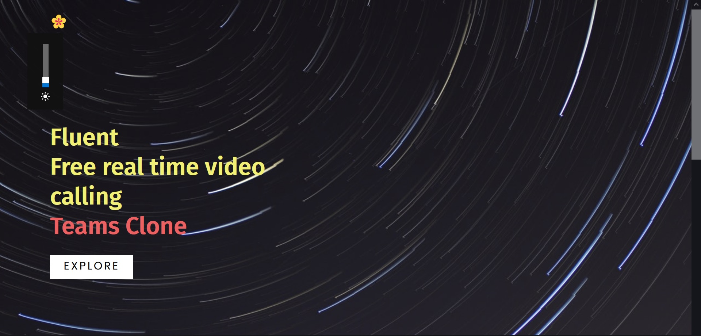
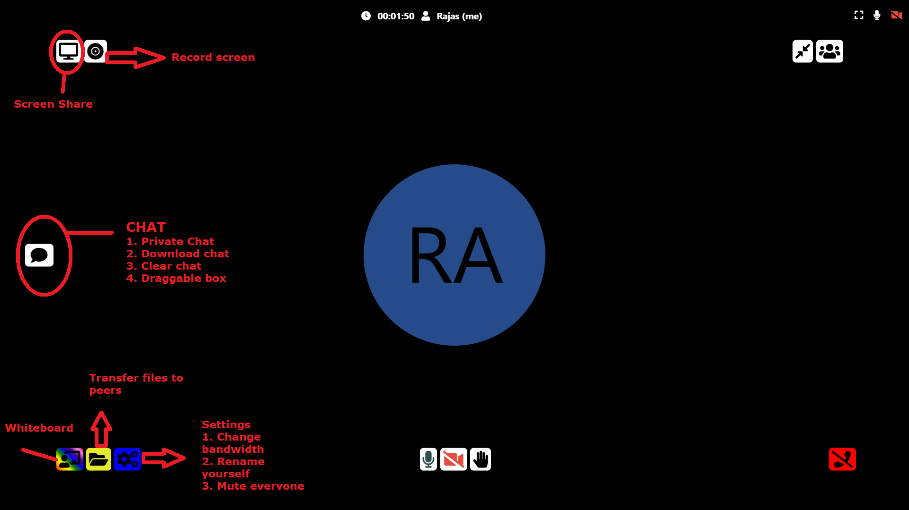
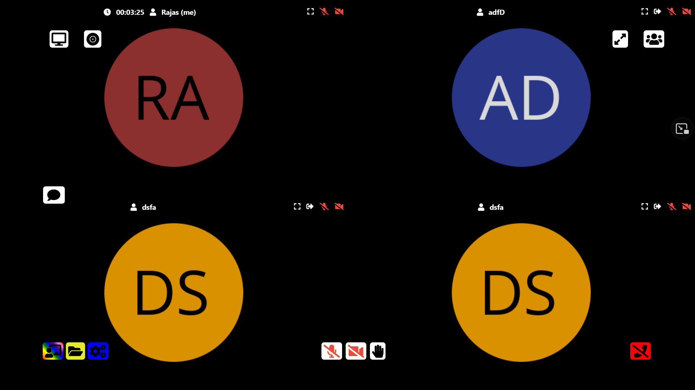

# Fluent

<br>

## Agile methodology (Timeline shown)

1. Week-1 : Worked on creating server using express and using webrtc to enable camera and mic
2. Week-2 : Adding screen-recording , screen-sharing and whiteboard in the app.
3. Week-3 : Adjusting to update chat feature announced. Added chat feature while meeting
4. Week-4 : Working on chat feature and preparing video for app demonstration. 

## Powered by `WebRTC` using google Stun

[](https://fluent-video.herokuapp.com/)

<br>

Open the app in one of following **supported browser**

[](https://fluent-video.herokuapp.com/)

## [Hosted App](https://fluent-video.herokuapp.com/)

## [Youtube Video](https://youtu.be/fYckR9TRPAI)

<br>

[](https://fluent-video.herokuapp.com/)

## Features

- Unlimited number of conference rooms without call time limitation
- Desktop and Mobile compatible
- Optimized Room Url Sharing (share it to your participants, wait them to join)
- Video Calling
- Audio Streaming
- Screen Sharing to present documents, slides, and more...
- File Sharing, share any files to your participants in the room
- Recording your Screen, Audio and Video
- Simple collaborative whiteboard for the teachers
- Full Screen Mode on mouse click on the Video element
- Direct `peer-to-peer` connection ensures lowest latency thanks to `webrtc`


[](https://fluent-video.herokuapp.com/)


### Unlimited participants

[](https://fluent-video.herokuapp.com/)


## Demo

- `Open` https://fluent-video.herokuapp.com

## Quick start

- You will need to have Nodejs installed.
- Clone this repo

```bash
git clone https://github.com/rajas2716/Fluent.git
cd Fluent
```
## Install dependencies

```js
npm install
```

## Start the server

```js
npm start
```

- Open http://localhost:3000 in browser

<p align="center"> Made by <a href="https://www.linkedin.com/in/rajas-p-05b2a3144/">Rajas Paunikar</a></p>